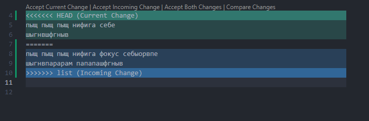

# Инструкция для работы с Git и удалёнными репозиториями

## Что такое Git?
Git - это одна из реализаций распределённых систем контроля версий, имеющая как и локальные, так и удалённые репозитории. Является самой популярной реализацией систем контроля версий в мире.
## Подготовка репозитория

### Git init

Для создание репозитория необходимо выполнить команду *git init*  в папке с репозиторием и у Вас создаться репозиторий (появится скрытая папка .git)

## Создание коммитов

### Git add
Для добавления измений в коммит используется команда *git add*. Чтобы использовать команду *git add* напишите *git add <"имя файла">*

### Просмотр состояния репозитория

### Git status
Для того, чтобы посмотреть состояние репозитория используется команда *git status*. Для этого необходимо в папке с репозиторием написать *git status*, и Вы увидите были ли измения в файлах, или их не было.

### Создание коммитов

### Git commit - m
Для того, чтобы создать коммит(сохранение) необходимо выполнить команду *git commit*. Выполняется она так: *git commit -m "<сообщение к коммиту>*. Все файлы для коммита должны быть ***ДОБАВЛЕНЫ*** и сообщение к коммиту писать ***ОБЯЗАТЕЛЬНО***.

## Перемещение между сохранениями

### Git checkout
Для того, чтобы перемещаться между коммитами, используется команда *git checkout*. Используется она в папке с пепозиторием следующим образом: *git checkout <номер коммита>*

## Журнал изменений

### Git log
Для того, чтобы посмтреть все сделанные изменения в репозитории, используется команда *git log*. Для этого достаточно выполнить команду *git log* в папке с репозиторием

### ПОДСКАЗКА! За дополнительной информацией обращайся к полному справочнику. 

[Git для профессионального программиста](https://gbcdn.mrgcdn.ru/uploads/asset/4245110/attachment/d4eb8c232f8f2bdf4e42ba7cb49e0c50.pdf)

## Ветки в Git

### Создание ветки

## git branch <название ветки>

Для того, чтобы создать ветку, используется команда *git branch*. Делается это следующим образом в папке с репозиторием: *git branch <название новой ветки>*

## Слияние веток

## git merge <название ветки>

Для того чтобы дабавить ветку в текущую ветку используется команда *git merge <name branch>*

## Удаление веток

## git checkout -d <название ветки>

Для удаления ветки ввести команду "git branch -d 'name branch'"

## Изменеие директории (полезные команды Markdown)

### cd 
Для перемещениям по директориям (например по папкам) достаточно через *tab* вызывать папку, с которой ведется работа.

## Вывод списка файлов

### ls
Команда *ls* позволяет вывести в терминале список файлов, находящихся в репозитарии.

# Решение конфликтов

Если в разных ветках мы редактировали один и тот же фрагмент кода, или текста, то при команде слияния веток возникнет конфликт версий, который предлагается решить (в интерфейсе Visual studio code существуют всплывающие подсказки с одним из четырех типов решения)
